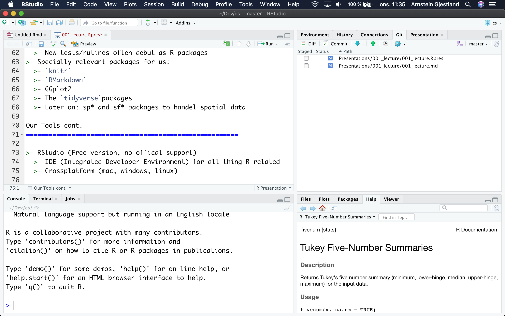
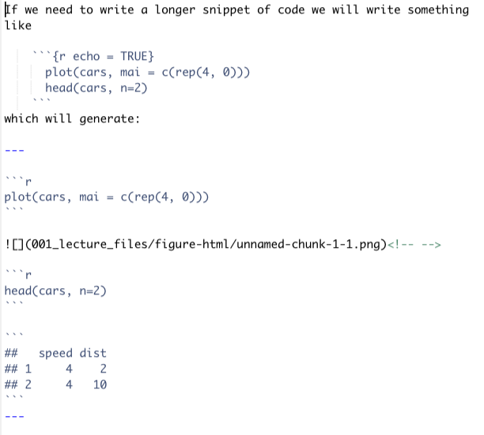
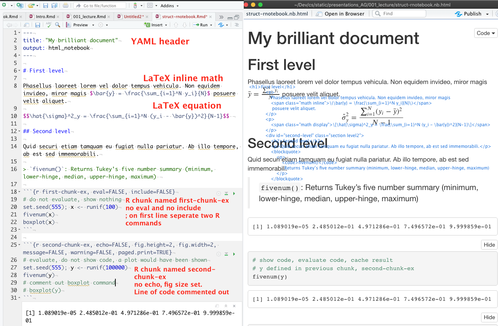
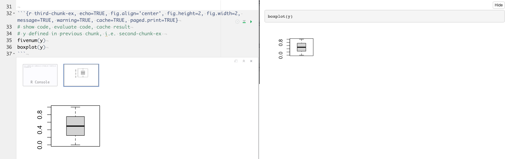
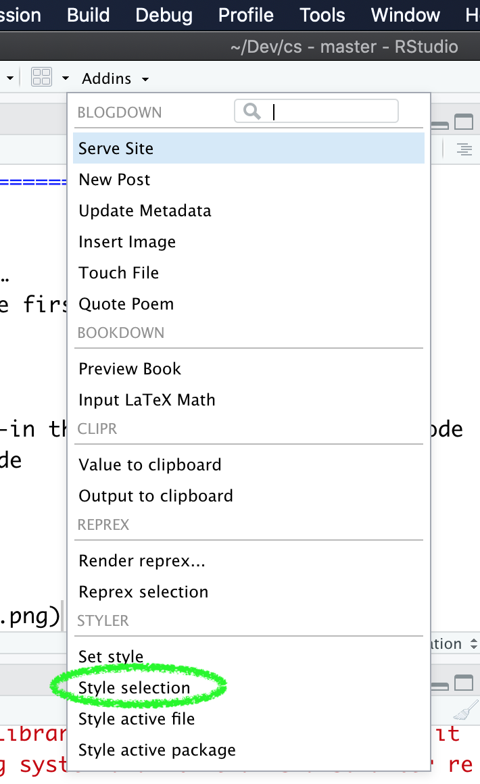
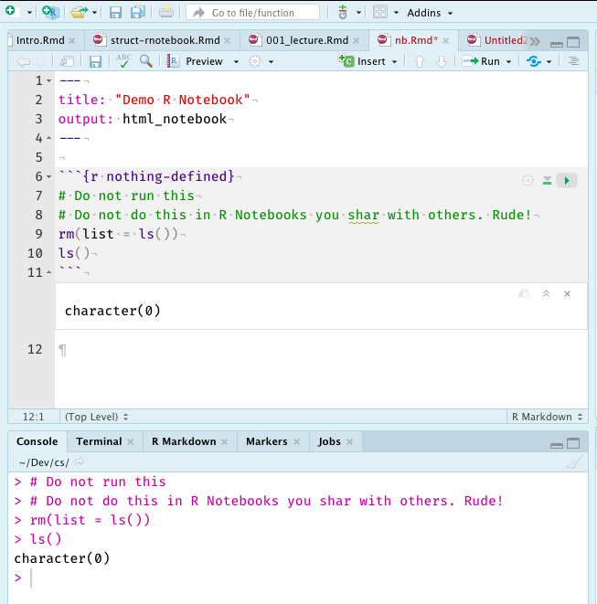
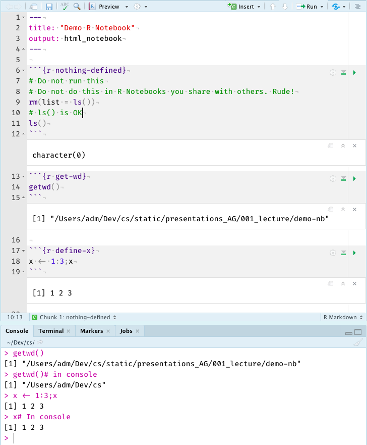
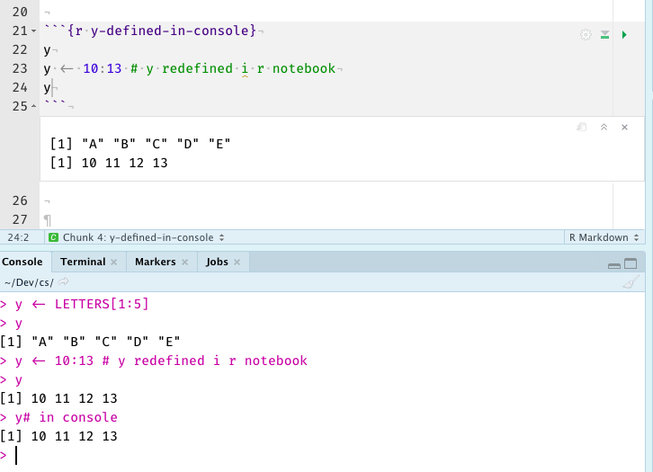
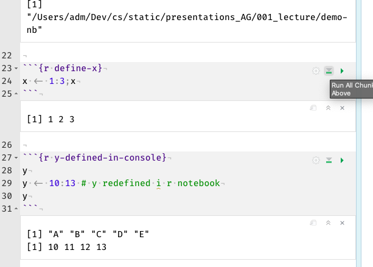

## Where to get more informations
>- [r4ds](https://r4ds.had.co.nz/r-markdown.html)
>- [Markdown](https://bookdown.org/yihui/rmarkdown/)
>- Help menu in RStudio
>- [R Markdown Reference Guide](https://rstudio.com/wp-content/uploads/2015/03/rmarkdown-reference.pdf)
>- R Markdown Cheat Sheet (se Help menyen i RStudio )

## Our Tools, short repetition

> - R, a statistical programming language (free implementation of the language S)
> - The “Lingua Franca” of the statisticians
>     - 15000+ packages
>     - New tests/routines often début as R packages
>     - [r tutorials](https://data-flair.training/blogs/r-tutorial/)
>     - Built in tutorials (install package `learnr`)
> - Especially relevant packages for us:
>     - `knitr`
>     - `RMarkdown`
>     - `GGplot2`
>     - The `tidyverse` packages
>     - Later on: `sp*` and `sf*` packages to handle spatial data

## Our Tools cont.

> - RStudio (Free version, no official support)
>- RStudio is an IDE (Integrated Developer Environment) for all thing R related
>- Cross platform (mac, windows, linux)

## Our Tools cont.


<div style="float: left; width: 65%;">
{width=100%}
</div>

<div style="float: right; width: 35%;">
>- **Upper left:** Editor
>- **Lower left:** Console and Terminal
>- **Upper right:** History, Environment, git, Presentation viewer and (from version 1.3) Tutorials.
>- **Lower right:** Files, Plots, Packages and Help
</div>

## Our Tools cont.

>- [$\LaTeX$](http://ftp.ntua.gr/mirror/ctan/info/lshort/english/lshort.pdf) (se kap. 3 for matte), used for pdf and math, ex. `$$\sum_{i=1}^I x_i$$` gives a display equation like
$$\sum_{i=1}^I x_i$$ While `$\sum_{i=1}^I x_i$` gives us an in-line equation like $\sum_{i=1}^I x_i$. We can also do something more fancy (see source for code) $$\mathbf{X} = \left(
\begin{array}{ccc}
x_1 & x_2 & \ldots \\ x_3 & x_4 & \ldots \\ \vdots & \vdots & \ddots
      \end{array} \right)$$

## Our Tools cont.

>- pandoc; works in the background and converts Markdown to different formats pdf(via latex), docx, html etc.
>- Pandoc is quite good at converting latex formulas, even into MS Word formulas.
>- Zotero; helps with gathering (Zotero connector) and building collection of references. 
     * Mac: Use Firefox or Chrome as browser. Support for Safari returning autumn 2020


## Why Markdown?

>- Easy to learn (manual 3-4 pages)
>- Flexible, can easily be converted into other formats like pdf (via latex), docx (MS Word), html etc.
>- Cross platform (mac, windows, Linux)
>- Plain text, facilitates use of distributed version control systems (support for git/github in RStudio)
>- Plain text, resilient with regard to technological change (plain text formats are more robust than binary formats)

## Why RMarkdown? cont.

>- RMarkdown is Markdown with support for R code (via knitr)
>- Rmarkdown documents can include R code (“statistics”) that is executed.
>- * Plots
>- * Tables
>- * Models
>- * Tests
>- Reproducible research (“The Golden Standard”)

## Examples Rmarkdown

Writing R-code in Rmarkdown documents.

We write in-line code as `` `r knitr::inline_expr("set.seed(1234); round(rnorm(3),3)")` `` which will give us `r set.seed(1234); round(rnorm(3),3)` in the text.

If we need to write a longer snippet of code we will write something like

```{r}`r ''`  
plot(cars, mai = c(rep(4, 0)))  
head(cars, n=2)
```
    
## Which will generate:

<div class="columns-2">
```{r}`r ''`  
plot(cars, mai = c(rep(4, 0)))  
head(cars, n=2)
```

```{r echo=FALSE, fig.width=5}
plot(cars, mai = c(rep(4, 0)))
head(cars, n=5)
```
</div>

## Examples Rmarkdown{.smaller}

<div class="columns-2">
We will write 

```{r eval=TRUE}`r ''`
      plot(cars, mai = c(rep(4, 0)))
      head(cars, n=2)
```

if we want to hide our beautiful code. Using echo=FALSE  will just give us the results and not the R-code. 

```{r echo = FALSE}`r ''`
      head(cars, n=3)
      plot(cars, mai = c(rep(4, 0)))
```

Some of these code-chunk options can be accessed via the cogwheel in the upper right corner of the code chunk. 

```{r, echo=TRUE, fig.height=3, fig.width=4}
head(cars, n = 3)
plot(cars, mai = c(rep(4, 0)))
```
</div>


## What happened here?{.smaller}

R was first run on the **R code** parts of our document and the package `knitr` converted the code and the results into **Markdown** chunks which was then inserted into our original **RMarkdown** document to replace the R-code. The resulting pure **Markdown** document was then converted to **html** (or .docx, .pdf, .rtf etc.)  by `pandoc`.

<div class="columns-2">
From the .md (Markdown) file:

{width=80%}

Remember that ```` ```code``` ```` is set as code in Markup

Again: `knitr` picks out the R-code in our RMarkdown document. It then runs the code through R and return the code (if echo=TRUE) and the output as Markdown text. This Markdown text is inserted into the RMarkdown document and replaces the R-code. Hence we end up with a pure Markdown document. This Markdown document is then in turn converted by pandoc into the format we want, i.e. html (default), pfd (via latex), MS Word etc..
</div>

## Structure of R Notebooks


{width=80%}


## Structure of R Notebooks


{width=80%}

>- can turn on/off: include, eval, cache, echo etc.
>- very flexible

## Important chunck options

<div class="columns-2">
See [rmarkdown cookbook chap. 11](https://bookdown.org/yihui/rmarkdown-cookbook/chunk-options.html) for more chunk options.

>- `cache=TRUE/FALSE` Turn on/off cache
>- `eval=TRUE/FALSE` Evalualte R code, or not
>- `echo=TRUE/FALSE` Show R code, or not
>- `fig.width=6` Width of figure
>- `fig.height=6` Height of figure
</div>


## R code style guide

> - We will have to write some R code
> - Best way to avoid bad habits …
> - is to never acquire them in the first place
> - hence we use `tidyverse` style guide ([tidyverse style guide](https://style.tidyverse.org))
> - Rstudio has integrated support for `tidyverse` style and will indicate when we err.
>     * Important to set the [Preferences...](pref-setup/ps.nb.html) correctly . Home work to next time.
> - Additional help from the AddIn **styler** (install the `styler` package to get the add-in)

## Rcode style guide

>- `install.packages("styler")`
   >- `Styler` is a package that installs an add-in that makes it easy to style code according to tidyverse style guide
>- When we have written some R-code, that could do with some styling, we first select the code and then select `Style selction` from the `Addins` drop-down menu.

## Add-in in Rstudio

<div class="columns-2">
{width=60%}

What’s in the `Addins` menu will depend on the packages we have installed.
</div>

## R Notebook

> - **R Notebook** 
>   * Everything, results, plots, warnings etc., will be in the `Notebook`
>   * `Working directory` is the same as the directory where the `Notebook`is placed.
>   * markdown + code in code chunks
>   * Support for citations and references?
>        - Quite good, but not everything is well documented

## R Notebook; empty

{width=50%}

## R Notebook; getwd

{width=50%}

## R Notebook; y-defined in console

{width=60%}

## R Notebook; run-all-above

{width=60%}


## Citations;  What we want to accomplish

```
---
title: "Citations in R Notebooks"
bibliography: citeRnotebook.bib
csl: apa-no-ampersand.csl
output: html_notebook
---

## What we want to accomplish:

The ideas of @gentleman2003, which were implemented by @gentleman2005 when parts of @golub1999 was reproduced 
as a *compendium* [@gentleman2003], i.e. reproducible
research. The @rstudioteam2020 implementation of `R
Notebook`is a modern ...[snip]
## References
<div id="refs"></div>
```

should give

## Citations; `csl: apa-no-ampersand.csl`

{width=80%}

## Citations; `csl: elsevier-harvard.csl`

{width=80%}

## Citations; `csl: chicago[snip]-ibid.csl`

{width=70%}

## pdf; `csl: apa-no-ampersand.csl` 

{width=60%}

## Citation, how does it work?

We have a .bib file. Trust me, you do not want to do this by hand.

```
@book{allaire2020,
  title = {Rmarkdown: {{Dynamic}} Documents for r},
  author = {Allaire, JJ and Xie, Yihui and McPherson, Jonathan and Luraschi, Javier and Ushey, Kevin and Atkins, Aron and Wickham, Hadley and Cheng, Joe and Chang, Winston and Iannone, Richard},
  date = {2020},
  url = {https://github.com/rstudio/rmarkdown}
}

@article{almas2012,
  title = {Norske børshandlede fond : en kvantitativ analyse av fondenes egenskaper},
  shorttitle = {Norske børshandlede fond},
  author = {Almås, Pål Jonas Brandåstrø and Andersen, Kristian Peder Mørtvedt},
  date = {2012},
  url = {https://openaccess.nhh.no/nhh-xmlui/handle/11250/169733},
  urldate = {2020-05-07},
  abstract = {Denne masterutredningen
```

## Citation, how does it work?{.smaller}


> - Use the `citekey` to pull out the info from the `.bib` file and places it in the reference list. Formated according to the CLS file.
> - Put in the citation, also according to CLS file.
>        - Two versions `@allaire2020` and `[@allaire2020]`
> - Only collect the entries we have cited (.bib can be huge and contain all references we have ever collected)
> - `<div id="refs"></div>` gives the placement of the reference list. If not given it will be put at the end of the document
> - How do we know the citekeys? The package `citr` installs a handy RStudio addin.

## Citation, how does it work?


## Citation, how to make the .bib file

> - [Zotero](https://www.zotero.org)
> - [Zotero Connector](https://www.zotero.org/download/)
>    * Mac: use Chrome or Firefox (Safari 14; autumn 2020 will probably have full support)
> - Install [`Better bibtex` for Zotero](https://retorque.re/zotero-better-bibtex/) 
>    * `https://retorque.re/zotero-better-bibtex/`
> - Install the `citr` package

## Øving{.smaller}

1) Install the extensions for Zotero
2) Find the article: Tidy Data by Hadley Wickham; Journal of Statistical Software and "harvest" the reference
3) Get bib info for the `citr` package. Copy the reference data into Zotero
    1) In R Console: print(citation(citr), base=bibtex)
    2) Import into Zotero: `Fil> Importer fra uklippstavle` (dvs. fra **Fil** menyen velg **Importer fra uklippstavle**)
4) Get bib info for R. Copy the reference into Zotero
    1) In R Console: print(citation(), base=bibtex)
5) Get bib info for the R package Tidyverse. 
6) Make a new project
7) Write a short text in a R Notebook where you use both the versions of citing, (i.e. with and without brackets) 
8) Use at least 5 commits

