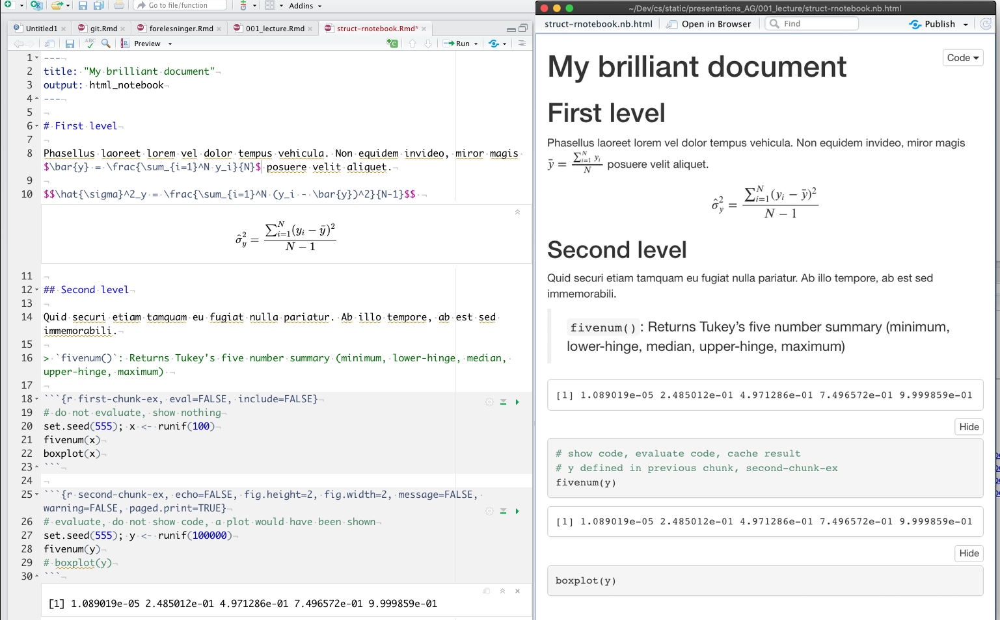
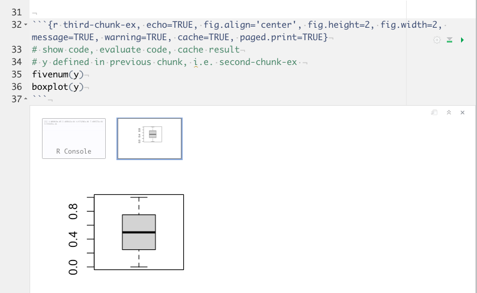

## Where to get more informations

>- [r4ds](https://r4ds.had.co.nz/r-markdown.html)
>- [Markdown](https://bookdown.org/yihui/rmarkdown/)
>- Help menu in RStudio
>- [R Markdown Reference Guide](https://rstudio.com/wp-content/uploads/2015/03/rmarkdown-reference.pdf)
>- R Markdown Cheat Sheet (se Help menyen i RStudio )

## Why Markdown?

>- Easy to learn (manual 3-4 pages)
>- Flexible, can easily be converted into other formats like pdf (via latex), docx (MS Word), html etc.
>- Cross platform (mac, windows, Linux)
>- Plain text, facilitates use of distributed version control systems (support for git/github in RStudio)
>- Plain text, resilient with regard to technological change (plain text formats are more robust than binary formats)

## Why RMarkdown? cont.

>- RMarkdown is Markdown with support for R code (via knitr)
>- Rmarkdown documents can include R code (“statistics”) that is executed.
>- * Plots
>- * Tables
>- * Models
>- * Tests
>- Reproducible research (“The Golden Standard”)

## Examples Rmarkdown

Writing R-code in Rmarkdown documents.

We write in-line code as `` `r set.seed(1234); round(rnorm(3),3)` `` which will give us -1.207, 0.277, 1.084 in the text.

If we need to write a longer snippet of code we will write something like

```{r}  
plot(cars, mai = c(rep(4, 0)))  
head(cars, n=2)
```

```{r}
1 + 1
```

```{r}
1 + 1
head(cars, n=2)
```

`​``{r eval=TRUE}
     n = 10
     rnorm(n)
     ```

    
which will generate:

---


```r
plot(cars, mai = c(rep(4, 0)))
```

<!-- -->

```r
head(cars, n=2)
```

```
##   speed dist
## 1     4    2
## 2     4   10
```

---
## Examples Rmarkdown

<div class="columns-2">

>- And we will write  
```{r eval=TRUE}
      plot(cars, mai = c(rep(4, 0)))
      head(cars, n=2)
````
>- if we want to hide our beautiful code. Using `echo=FALSE` will just give us the results and not the R-code.  
```{r echo = FALSE}
      plot(cars, mai = c(rep(4, 0)))
      head(cars, n=2)
````
>- Some of these code-chunk options can be accessed via the cogwheel in the upper right corner of the code chunk. 

<!-- -->

```
##   speed dist
## 1     4    2
## 2     4   10
```
</div>

## What happened here?


R was first run on the **R code** parts of our document and the package `knitr` converted the code and the results into **Markdown** chunks which was then inserted into our original **RMarkdown** document to replace the R-code. The resulting pure **Markdown** document was then converted to **html** (or .docx, .pdf, .rtf etc.)  by `pandoc`.

---
<div class="columns-2">
From the .md (Markdown) file:

{width=80%}

Remember that ```` ```code``` ```` is set as code in Markup.

Again: `knitr` picks out the R-code in our RMarkdown document. It then runs the code through R and return the code (if echo=TRUE) and the output as Markdown text. This Markdown text is inserted into the RMarkdown document and replaces the R-code. Hence we end up with a pure Markdown document. This Markdown document is then in turn converted by pandoc into the format we want, i.e. html (default), pfd (via latex), MS Word etc..
</div>

## Structure of R Notebooks


{width=80%}

## Structure of R Notebooks

<div class="columns-2">
{width=90%}

>- can turn on/off: include, eval, cache, echo etc.
>- very flexible
</div>

## Important chunck options

<div class="columns-2">
See [rmarkdown cookbook chap. 11](https://bookdown.org/yihui/rmarkdown-cookbook/chunk-options.html) for more chunk options.

>- `cache=TRUE/FALSE` Turn on/off cache
>- `eval=TRUE/FALSE` Evalualte R code, or not
>- `echo=TRUE/FALSE` Show R code, or not
>- `fig.width=6` Width of figure
>- `fig.height=6` Height of figure
</div>

## Our Tools, short repetition

> - R, a statistical programming language (free implementation of the language S)
> - The “Lingua Franca” of the statisticians
>     - 15000+ packages
>     - New tests/routines often début as R packages
>     - abc [r tutorials](https://data-flair.training/blogs/r-tutorial/) abc
>     - Built in tutorials (install package `learnr`)
> - Specially relevant packages for us:
>     - `knitr`
>     - `RMarkdown`
>     - `GGplot2`
>     - The `tidyverse` packages
>     - Later on: `sp*` and `sf*` packages to handle spatial data

## Our Tools cont.

> - RStudio (Free version, no official support)
>- RStudio is an IDE (Integrated Developer Environment) for all thing R related
>- Cross platform (mac, windows, linux)

## Our Tools cont.


<div style="float: left; width: 65%;">
{width=100%}
</div>

<div style="float: right; width: 35%;">
>- **Upper left:** Editor
>- **Lower left:** Console and Terminal
>- **Upper right:** History, Environment, git, Presentation viewer and (from version 1.3) Tutorials.
>- **Lower right:** Files, Plots, Packages and Help
</div>

## Our Tools cont.

>- LaTeX, used for pdf and math, ex. `$$\sum_{i=1}^I x_i$$` gives a display equation like
$$\sum_{i=1}^I x_i$$ While `$\sum_{i=1}^I x_i$` gives us an in-line equation like $\sum_{i=1}^I x_i$.
>- pandoc; works in the background and converts Markdown to different formats pdf(via latex), docx, html etc.
>- Pandoc is quite good at converting latex formulas, even into MS Word formulas.
>- Zotero; helps with gathering and building collection of references

## R code style guide

>- We will have to write some R code
>- Best way to avoid bad habits …
>- is to never acquire them in the first place
>- hence we use `tidyverse` style guide ([tidyverse style guide](https://style.tidyverse.org))
>- Rstudio has integrated support for `tidyverse` style and will indicate when we err.
>- Additional help from the AddIn **styler** (install the `styler` package to get the add-in)

## Rcode style guide

>- `install.packages("styler")`
   >- `Styler` is a package that installs an add-in that makes it easy to style code according to tidyverse style guide
>- When we have written some R-code, that could do with some styling, we first select the code and then select `Style selction` from the `Addins` drop-down menu.

## Add-in in Rstudio

<div class="columns-2">
{width=60%}

What’s in the `Addins` menu will depend on which packages we have installed.
</div>
