# Setup preferences in R Studio

We set up the RStudio preferences so that we all work in an identical environment.

Select `Preferences..` from the `File` menu.

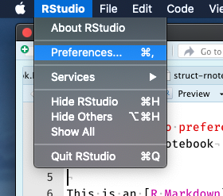

## General:Basic

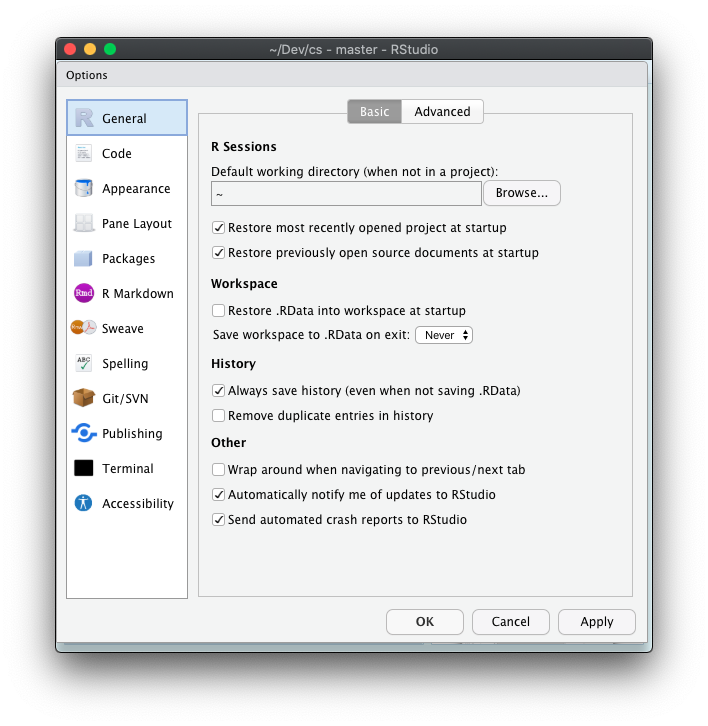

## General:Advanced

## Code:Editing

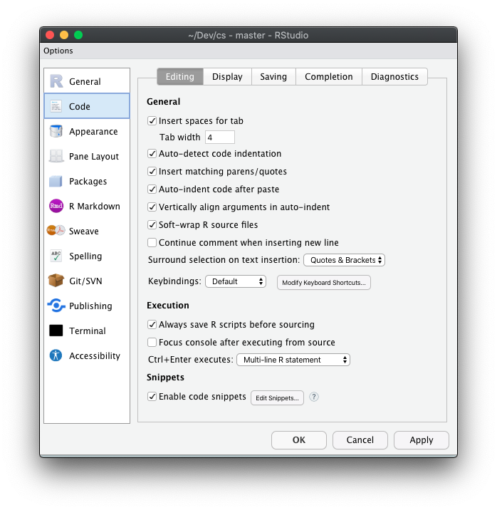
## Code:Display

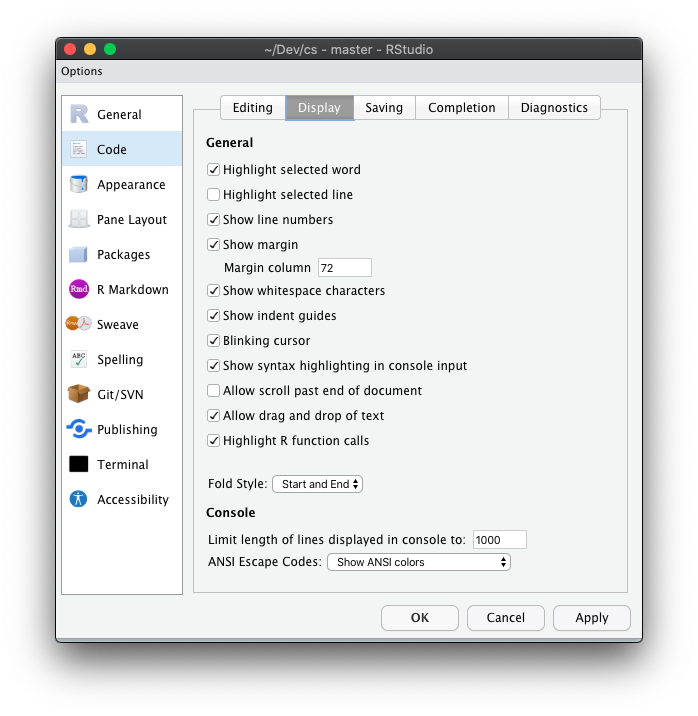
## Code:Saving

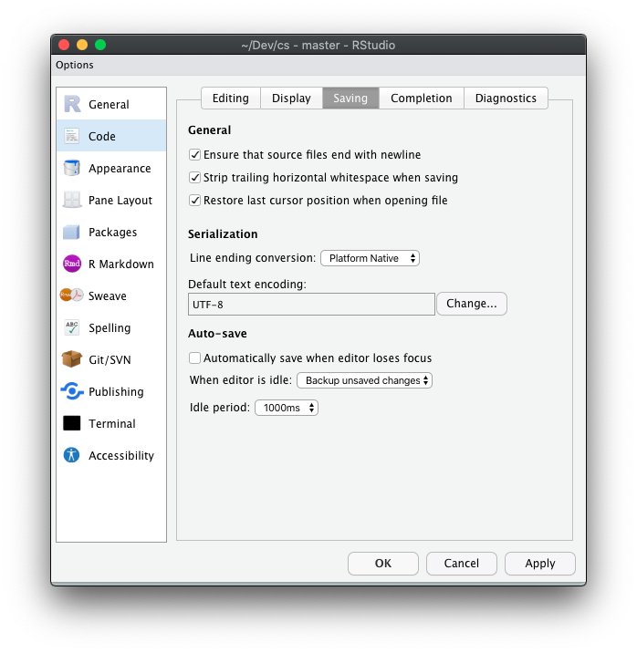

## Code:Completion

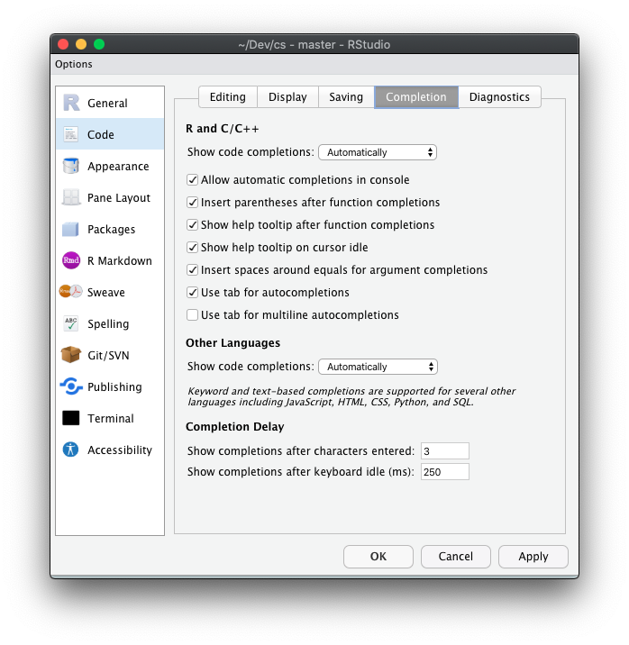

## Code:Diagnostic

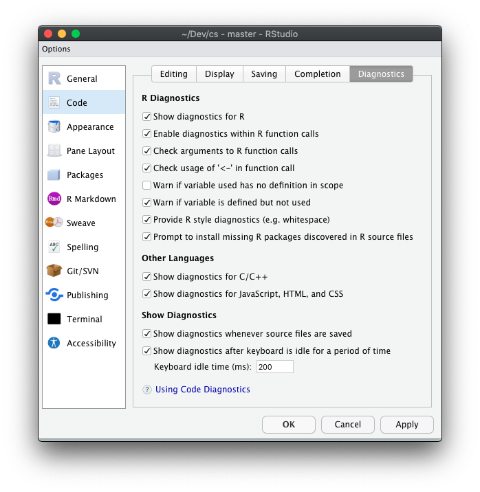

## Appearance

What font to use is up to you, but use a fixed-width font. I like [fira-code](https://www.fontsquirrel.com/fonts/fira-code). Courier or Monaco are good alternatives.

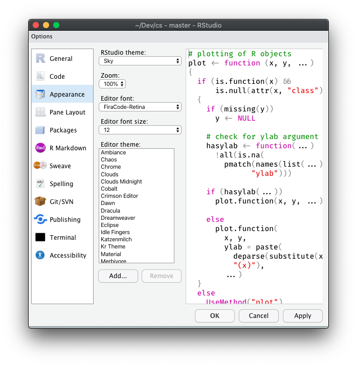

## Pane layout

## Packages:Management

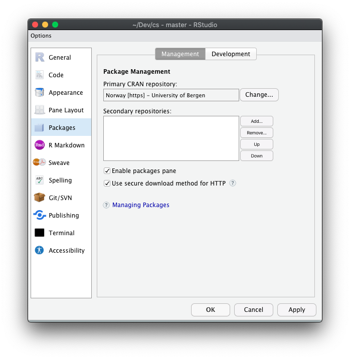

## Packages:Development

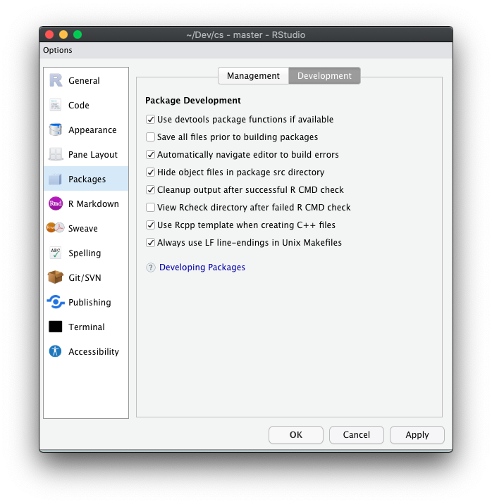

## R Markdown

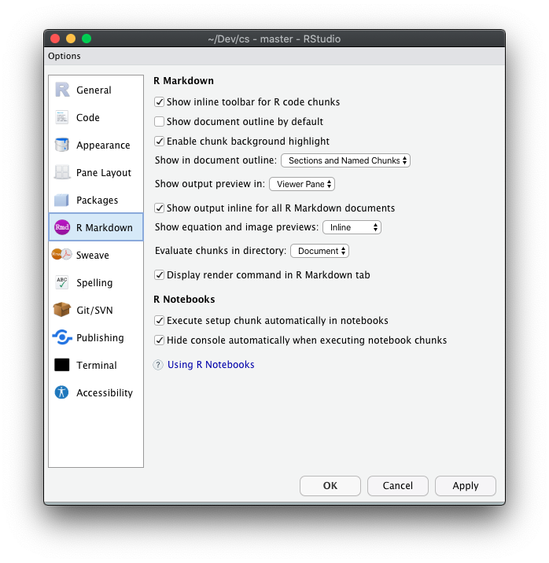

## Sweave

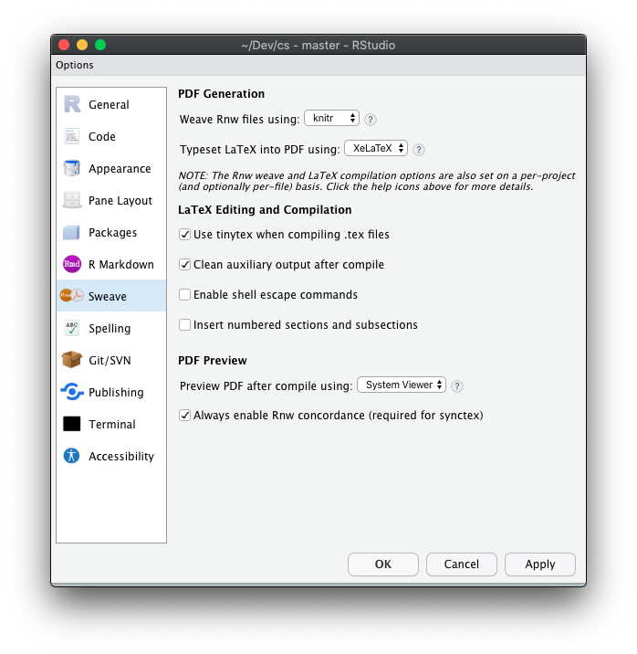

## Spelling

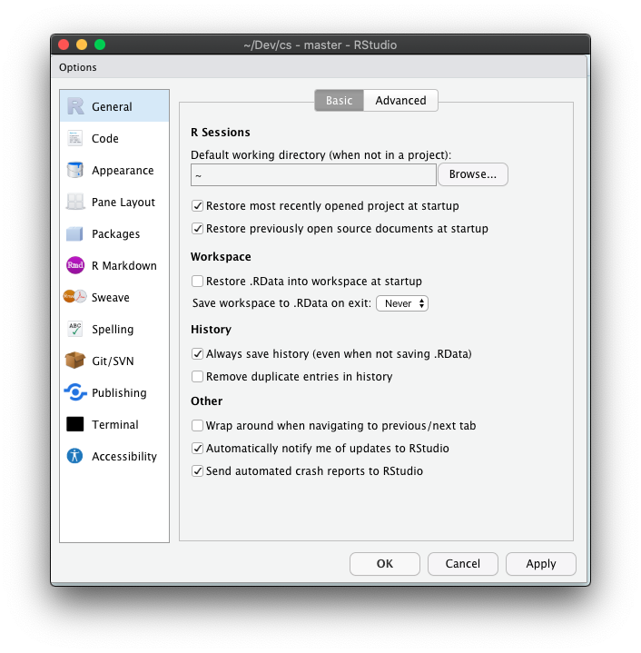

Choose `Install More Languages...`from the `Main dictionary language:` drop-down menu. Norwegian should now be in the menu.

## Git/SVN

We are only going to use Git so SVN is not to important.

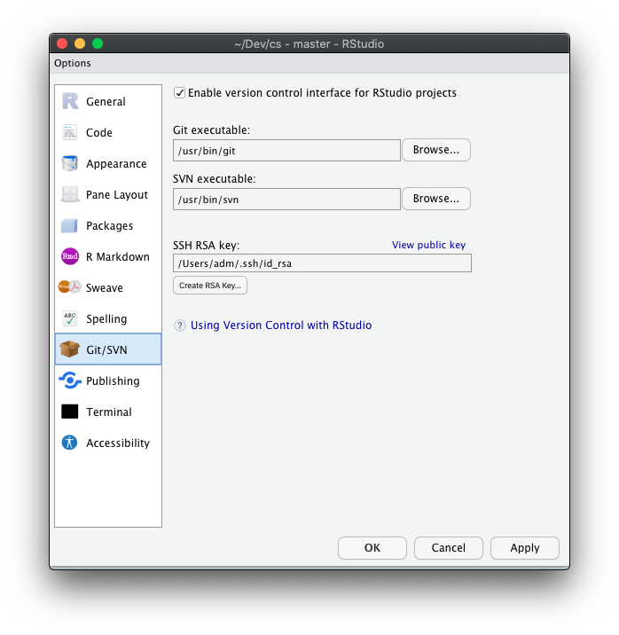

## Publishing

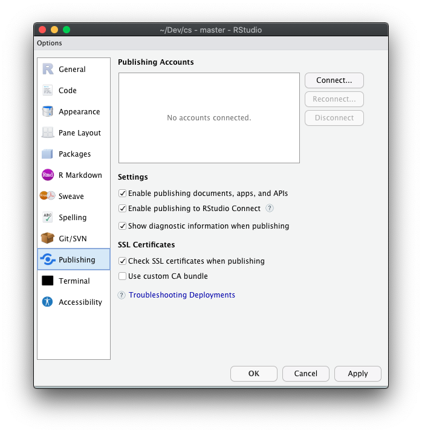

## Terminal:General

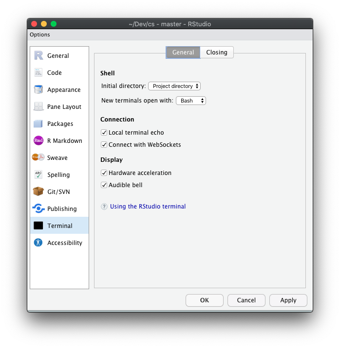

## Terminal:Closing

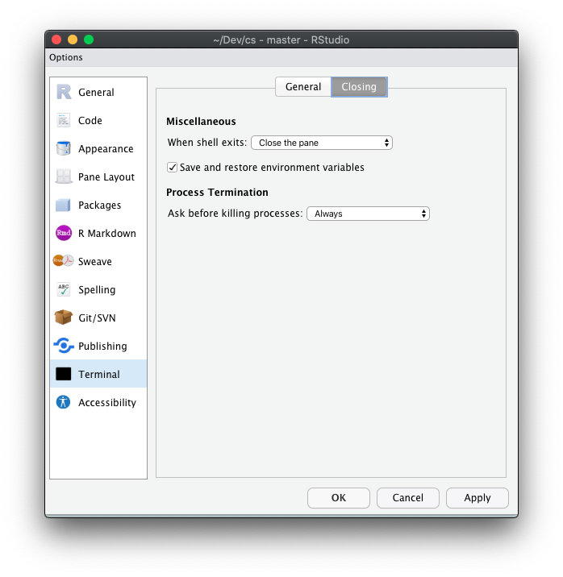

## Accessibility:General

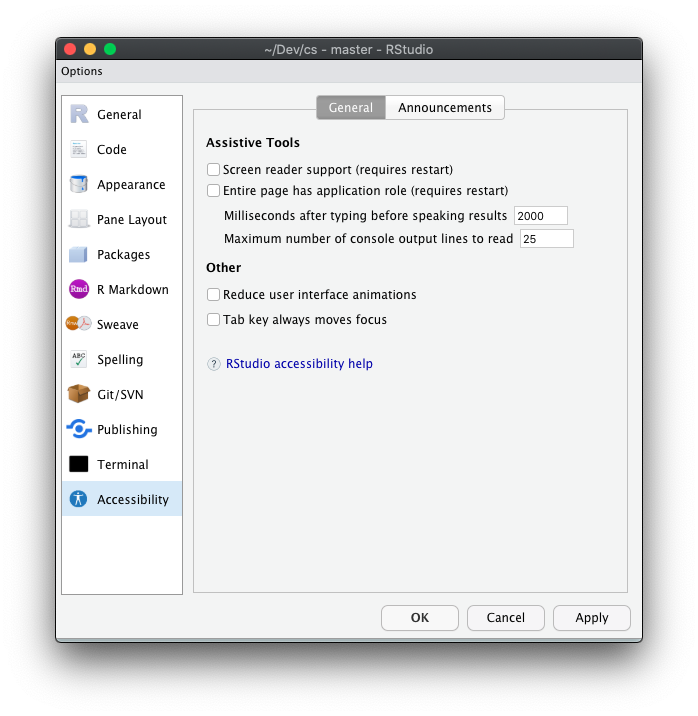

## Accessibility:Announcements

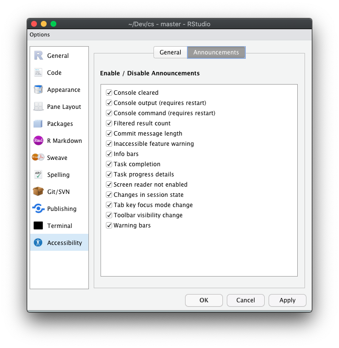

